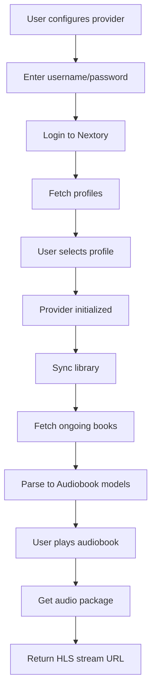

Implementation Plan - Nextory Music Assistant Provider (MVP)

Problem Statement:
Create a minimal Music Assistant provider for Nextory audiobook streaming service to validate the integration works, using the existing nextory Python API client.

Requirements:
- Authentication via username/password with profile selection during setup
- Fetch audiobooks from the "ongoing" library list
- Stream audiobooks using HLS URLs (unencrypted)
- Minimal implementation to test if the integration works

Background:
Based on research of the Music Assistant codebase:
- Providers extend MusicProvider base class
- Need manifest.json for provider metadata
- get_config_entries() handles configuration UI
- SUPPORTED_FEATURES declares capabilities (e.g., LIBRARY_AUDIOBOOKS, BROWSE)
- Audiobooks use Audiobook model with ProviderMapping
- Streaming uses StreamDetails with StreamType.HLS for HLS streams
- The Nextory client provides: login(), get_profiles(), select_profile(), get_libraries(), get_library(), get_product_details(), get_audio_package(), get_position()

Proposed Solution:
Create a new provider at music_assistant/providers/nextory/ with:
1. manifest.json - Provider metadata with nextory dependency
2. __init__.py - Main provider with authentication, library sync, and streaming

Task Breakdown:

Task 1: Create provider manifest and basic structure
- Objective: Set up the provider folder structure with manifest.json
- Implementation:
  - Create music_assistant/providers/nextory/ directory
  - Create manifest.json with type "music", domain "nextory", requirements ["nextory"]
  - Create empty __init__.py with basic imports
- Test: Provider folder exists with valid manifest
- Demo: Provider appears in Music Assistant's available providers list (though not yet functional)

Task 2: Implement configuration entries for authentication
- Objective: Create config UI for username, password, and profile selection
- Implementation:
  - Implement get_config_entries() with username/password fields
  - Add action-based flow: authenticate → fetch profiles → select profile
  - Store login_token, login_key, profile_token in hidden config fields
- Test: Config entries render correctly, action flow works
- Demo: User can enter credentials and see profile selection dropdown

Task 3: Implement provider initialization and client setup
- Objective: Initialize NextoryClient with stored credentials
- Implementation:
  - Create NextoryProvider class extending MusicProvider
  - Implement handle_async_init() to create client with stored tokens
  - Implement setup() function
  - Define SUPPORTED_FEATURES = {ProviderFeature.LIBRARY_AUDIOBOOKS, ProviderFeature.BROWSE}
- Test: Provider initializes without errors when credentials are valid
- Demo: Provider shows as connected in Music Assistant

Task 4: Implement library audiobooks retrieval
- Objective: Fetch and parse audiobooks from Nextory's "ongoing" library
- Implementation:
  - Implement get_library_audiobooks() async generator
  - Find "ongoing" list from get_libraries()
  - Fetch products via get_library(LibraryListType.ONGING, list_id)
  - Parse ProductResponse to Music Assistant Audiobook model
  - Filter for HLS format only (audiobooks, not ebooks)
- Test: Audiobooks appear in library after sync
- Demo: User sees their Nextory audiobooks in Music Assistant library

Task 5: Implement single audiobook retrieval
- Objective: Get full audiobook details by ID
- Implementation:
  - Implement get_audiobook(prov_audiobook_id)
  - Call get_product_details(book_id)
  - Parse to Audiobook model with full metadata
- Test: Clicking an audiobook shows correct details
- Demo: Audiobook details page displays title, author, narrator, cover image

Task 6: Implement stream details for playback
- Objective: Return HLS stream URL for audiobook playback
- Implementation:
  - Implement get_stream_details(item_id, media_type)
  - Extract HLS format identifier from audiobook
  - Call get_audio_package(format_id) to get audio files
  - Return StreamDetails with StreamType.HLS and M3U8 URL from first file
- Test: Playback starts when user plays an audiobook
- Demo: User can play an audiobook and hear audio streaming
